# He used What?? 
### The Girl Talk samples quiz that you can finally play outside of your own head
Girl Talk is a mash-up artist, sampling an eclectic collection of music to create original and dynamic songs. This online quiz tests your musical knowledge to see if you can name the artist or song he is sampling. Find the quiz <a href="https://smtilson.github.io/pp2-quiz-project/" target="_blank">here</a>.

## Table of Contents 
- [Title](#title)
- [Introduction](#intro)
- [Features](#features)
- [Testing](#testing)
- [Deployment](#deployment)
- [Credits and Outside Sources](#credits)

## Introduction 

"He Sampled WHAT??" is a musical quiz based on the album All Day by Girl Talk. Girl Talk is the most widely recognized mash-up artist. He makes music by sampling different songs to construct original collages triggering deep feelings of nostalgia. Inevitably, when listening to his music I try to figure out what songs he has sampled. This is that game. It is very challenging due to his eclectic taste. The point  of the game is to enhance the listening experience.

This game is implemented for all songs on All Day, and we hope to eventually implement it for all of Girl Talks' albums. As well as the Grey Album by Danger Mouse, and the works of other mashup artists.

### Project Description
This site is an interactive game. The user guesses which artists and songs are sampled in the song that is playing.

#### Example
This game can be difficult. The following is suggested for those who would like to experience the app but are unable to correctly guess any of the songs or artists that are sampled.

To evaluate the features of this game we suggest the following input:
 - For Oh No, the first song, submit Jay-z, Jay z, The Ramones, Ram ones, and Warpigs. The user will receive feedback that they are correct each time. Jay-Z, Ramones, and War Pigs will be logged in the left panel. The score will be 3 and the completion percentage will be 6%. When Jay z and Ram ones are submitted, the score will not be increased and the log will not be updated. The user will receive feedback encouraging them to try something new.
 - For Oh No, submit Taylor Swift, white StRipes, and the White Stri pes. The user will receive feedback that they are incorrect. Taylor Swift and white StRipes will be logged to the right panel. The score and completion percentage will not increase. When the White Stri pes is submitted the log will not be updated and the user will be encouraged to try something new.
 - For any song, submit aaaaaaaaaaaaaaaaaaaa. The user will receive feedback that this submission is not considered a serious attempt and that they should try again. Nothing is logged and the score and completion percentage are not increased.
- Now proceed to another song, using the arrow buttons, submit some guesses and then navigate using back, using the arrow buttons. Your progress will appear as it was. The same items will be logged and the your score and completion percentage will be listed. The feedback box will have the same feedback as it previously had.
- For Every Day, the last track, submit Fine young cannibals, Imagine, John Lennon, Jay-z, and Gucci Mane. These are all correct submissions. The feedback box will behave as described above. The score will read 5 and the completion percentage will read 9%.

### User Demographics
The expected user is interested in music and perhaps very interested in Girl Talk. There is no prerequisite of having heard or having not heard Girl Talk before. Familiarity with modern pop music is necessary. Familiarity with hip hop and club rap will be very helpful. As the album was released in 2010, nothing more recent is necessary.

### Wireframes
After the initial brainstorming, I used Balsamiq to make wireframes for the mobile and desktop versions of the site. Further development necessitated deviation from these initial plans.

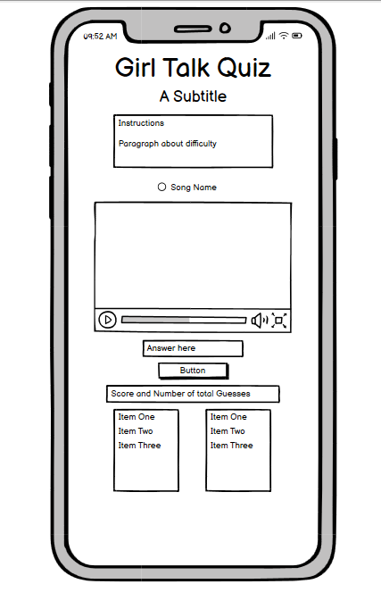

Due to space limitations, the instructions were moved to a landing page. An area was also added for displaying feedback to the user.

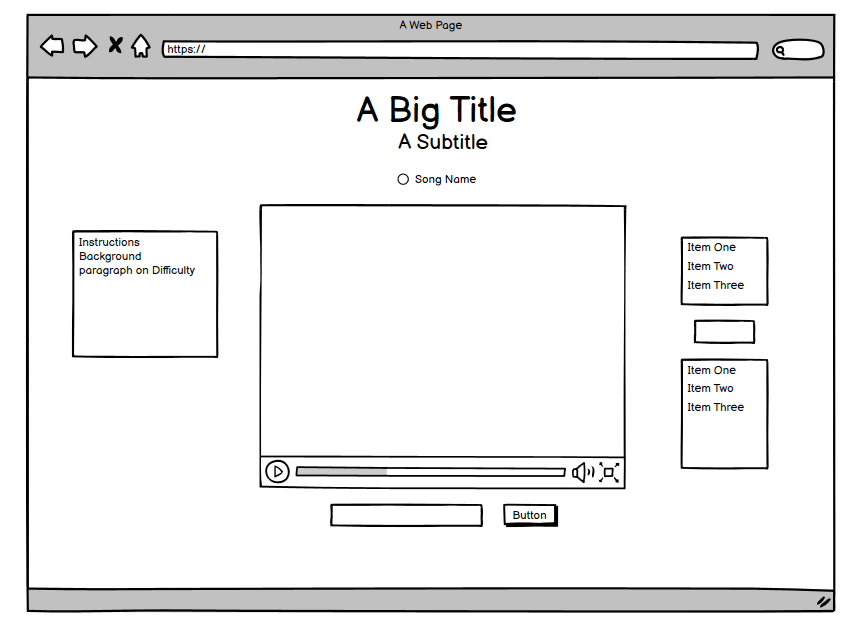

[return to Table of Contents](#toc)

## Features 
### Features
#### Landing Page
User stories:
- As a user, I visit the landing page and read the instructions for the game. I am told what kinds of answers to submit.
- As a user, I click on the "Let's Go" link and am taken to the game page. On page load, my cursor is in the input field.

The landing page contains instructions for the game. The instructions explains what type of quiz this is and what types of answers to submit. The landing page also contains a "Warning" paragraph about the difficulty of the quiz. It is meant to encourage players who are unfamiliar with Girl Talk.

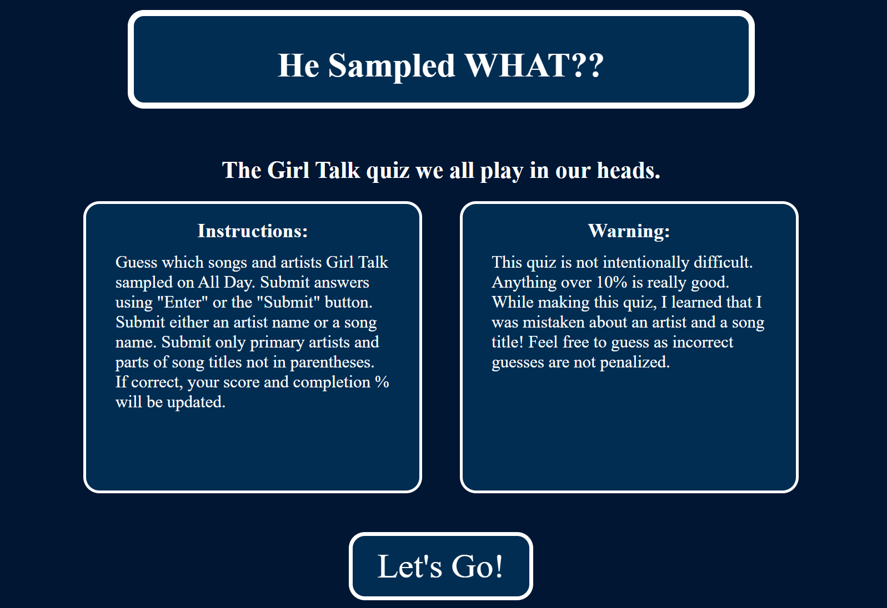

On the left are instructions for the game. On the right is a warning about the difficulty of the quiz. (If you wish to cheat, please see [this reference](#solutions) for a link to the answers.)
Below these, there is a button which takes the user to the main game page.

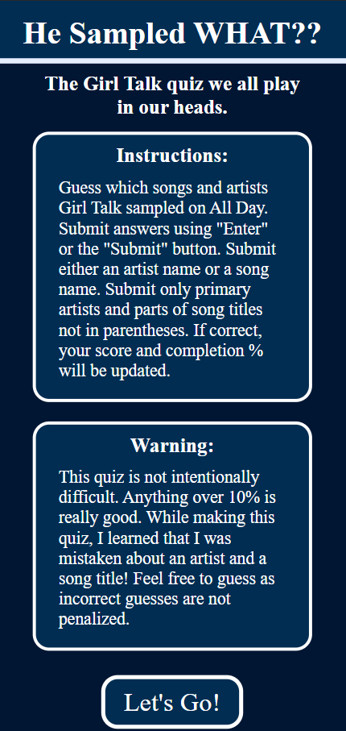

On mobile, these elements are displayed vertically.

#### Game Page
User stories:
- As a user, I type a guess and push the enter key/click the "Submit Answer" button with the mouse. The guess is submitted. I receive feedback telling me if the guess is correct. If it is correct, my score and completion percentage are updated. The input field emptied and my cursor is there.
- As a user, I submit a new guess. The guess is logged by being written on the left if it is correct and on the right if it is incorrect.
- As a user, I submit a guess I have already submitted. It is not logged and my score is not impacted. I am encouraged to try something new.
- As a user, I click the right arrow button on the game page. The game is updated so that it is set for the next track on All Day. The score, completion percentage, and logging areas updated as well.
- As a user, I click the left arrow button on the game page. The game is updated so that it is set for the previous track on All Day. The score, completion percentage, and logging areas are updated as well.
- As a user, I click the back button on the game page. I am taken to the landing page with the instructions.

The game page displays the song title and album name. This informs the user which song they are submitting guesses for. Below this, there is an embedded youtube video. This allows a user to listen to the song as they takes the quiz. It does not autoplay.

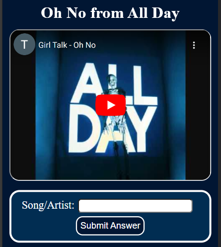

There is an answer area with an input field. It is labelled with "Song/Artist" to remind the user they should be entering only one, and not both. The guess can be submitted using the enter key or by clicking/tapping the "Submit Answer" button.

Once the user submits an guess, it is processed into a normalized format. This is to avoid simple errors like "the ramones" or "Mia" when the official answers are "Ramones" and "M.I.A.", respectively. Feedback is then displayed to the user related to their guess. It tells them if their guess was correct. If they have already submitted that guess, it encourages them to try something new. This is what would be displayed if a user submitted the same guess an additional time.

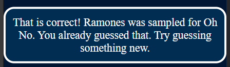

There are two score related areas. In mobile, they are next to each other.

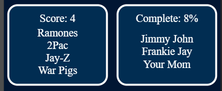

On the left, the score is given and correct guesses (the official form) are logged. On the right, the percentage of total correct answers is given and incorrect answers are logged. When a user goes to a new song/question, these areas are reset. When a user returns to a song/question they have already made progress on, the score area is reconstructed as it was when they last attempted that question. (Note: this does not remain when the browser is refreshed and the javascript files are reloaded.)

To prevent overflow of these areas, a function catches any guess containing a word more than 20 characters long (without a space).

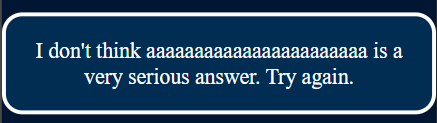

On larger screens, the score areas are on either side of the video.

For navigation, there are three buttons at the bottom of the page. The left arrow button loads the game for the previous track on the album. The right arrow button loads the game for the next track on the album. Loading the game for a different track updates the score, percentage, and logging areas. The back button takes the user back to the landing page with instructions. (This will cause the javascript files to reload and the progress in the game will be lost.)

### Future improvements

- Implement lazy loading for youtube videos
- Implement advanced scoring, for example: the user gets a bonus for guessing the sample while it is playing.
- Add more Girl Talk albums.
- Change videos to be from Girl Walk.
- Add links to wiki incase they guess one of the unknown samples.
- Add functionality that takes alternate names of artists and common misspellings.
- Add animations to indicate how many samples are currently playing.

[return to Table of Contents](#toc)

## Testing 

### Testing Features
I tested the initial version of logging and scoring with custom functions. Since significant refactoring, I have tested them manually. I have tested all buttons manually on mobile and on desktop.

### Testing the Game itself
During early development, when the game was only implemented for the first track, I used some functions to test that the game was functioning as expected when given specified input. These functions can be found in testing.js. Due to refactoring, they no longer function appropriately. Since those refactors, I have been testing manually. I have played the game for the first 7 tracks and found some bugs that I have fixed, which will be detailed below. These integration tests ensured that the events were being appropriately triggered in mobile and on desktop. I have also had a few friends play the game.

### Testing responsiveness
To test responsiveness, I used chrome dev tools. I considered the following screen sizes:
- On mobile: 320x628, 375×667, 414×736, 360×800, 390×844
- Larger: 768x1024, 1024x768, 933x622, 1024x622
The game functioned on all of these. I used breakpoints in my CSS to address when the width and height change.

### Validation

#### HTML
The HTML has been validated with [W3 HTML validator](#html-validator). The only issues were:
- trailing '/>' on elements in the head that were introduced by the [HTML formatter](#html-formatter) I used;
- a button element that was wrapped in an anchor tag.
Both of these have been addressed.

#### CSS
The CSS was validated with [Jigsaw CSS validator](#css-validator). No errors were found.

#### Javascript
The Javascript has been validated by [JSHint](#js-validator). There were no major issues.
It caught:
- missing semi-colons
- unnecessary trailing commas
These were immediately corrected.

It mentioned:
- 'const', 'let', '=>', and 'for of' loops only being available in ES6.
- 'for in' loops should be called inside of an 'if' block.
- functions being called that are not defined in the body of that JS file
- variables that are not used in the body of that JS file

Regarding 'for in' loops. They are used only with objects I control and so the keys/indices can not be tampered with and no index errors will occur.

Regarding the last two points. In order to compartmentalize and organize the work split my main file into several parts. I moved utility functions, mostly used for formatting, to a separate file, utility.js. I moved all of the data that is stored to database.js. This causes no problem at runtime as this files are loaded in proper order. Therefore the functions called are already in the namespace before they are called.

### Bugs
- There were special dash characters contained in the raw data that was used for the solutions.

Fix: This was addressed by [SO dash question](#so-dash-question). I removed the special characters initially using the code suggested there but later used my replaceAll function.

- Capitalize was throwing an error. This was due to it being fed an empty string.

Fix: Capitalize is only called by toTitle. So trim() is called before capitalize is to address this issue.

- Certain correct song titles were not being marked correct.

Fix: When refactoring to package all utility functions into a single object, a function was not properly replaced. Thus, the check to see if a user answer was a song that was sampled was failing automatically. This has been fixed. The utility object was later made into utility.js.

- Automated tests revealed that submissions were being over-counted.

Fix: This was due to using only toLowerCase() and not the norm() function. This was fixed.

- The wrong format of correct answer was being logged.

Fix: In the compareGuess function, I was not setting a new variable for the comparison and so the wrong string was being returned by compareGuess. This was fixed

- The core game play loop was not loading.

Fix: The issue was that an old event handler which was deleted had not yet been removed from the set up. It was being added as a listener, but the function no longer existed. This was fixed.

- The javascript files were not loading.

Fix: There was a typo in an array definition and some missing semi-colons. Fixing these addressed the issue.

- When loading game.html, a 'mouseover' event was causing an empty string to be submitted.

Fix: This was fixed by catching empty strings and preventing them from being submitted. Subsequently, 'mouseover' event listeners were completely removed.

- When submitting an answer with button click, or enter key playSongQuiz was being called too many times.

Fix: The above fix addressed this. I also refactored how the function was being assigned to the listener, I believe this also addressed the issue.

- At 320px, the body was not properly centered.

Fix: Changing video iframes to width==300 height=225 addressed the issue. [SO: body width question](#so-body-width-question)

- Submitting a string with a space at the end, which happens if you auto-complete an answer, causes an error (my wife encountered this when I was showing her the app).

Fix: This was fixed by adding a call to trim(), it was related to the issue above where capitalize is being fed an empty string.

- Going to next or prev question reset the score area location.

Fix: This was properly addressed by changing the function changeQuestion. Instead of writing new HTML it simply updates certain elements.

- adjustForLargeScreens (now moveRecordDivs) was preventing event handlers from being added.

Fix: The function was being called too many times. The second time it is called it attempts to get an element that it has removed, and so the function throws an error. This was fixed by removing one of the function calls.

- Submitting answers shifts the screen.

Fix: This was addressed by modifying the height and width of the feedback element so that it doesn't change dynamically.

- Incorrect submissions panel was unevenly spaced when compared to the correct submissions panel.

Fix: The earlier version of the adjustForLargeScreens function only set the display value to none. Thus the gap from the parent element was being applied to these empty elements. Removing the elements resolved this.

- Refactor to add submission lists broke alreadyGuessed function.

Fix: This was fixed by refactoring alreadyGuessed to look at the submission lists instead of the HTML.

- Long submissions cause the submissions container to overflow (issue 18 and 20 appear to be the same).

Fix: This was addressed by catching submissions that have words of more than 20 characters and flagging them as nonsense. The normal gameplay loop is prevented and specific feedback is given.

- If there are too many submissions, they get pushed underneath the Score/Completion percentage.

Fix: Addressed this by setting a margin-top value to the div containing the list.

- On large screens, the submission containers are squeezed. This is due to the div containing them being constricted.

Fix: I could not figure out what was causing this. I looked at every width statement in my CSS file. In the end, I fixed this by setting the width of the relevant element to be in terms of vw on larger screens.

- Incorrect entries are logged twice.

Fix: This was because the wrong thing was being pushed to the incorrectAnswers array. This was fixed by changing when the alreadyGuessed function is called.

- Media queries for screens of min-width 360px were causing issues.

Fix: I fixed this by removing them as they were no longer relevant.

- False negative for answers with special characters.

Fix: I manually edited answers in the database file where I found special characters.

- When changing the question, the scores were erased instead of being reset to 0.

Fix: I addressed this by adding a resetValue parameter to the resetElementById function.

- Feedback area on new question displays undefined.

Fix: The resetElementById call was removed completely.

- Previous song button on Oh No doesn't change the song.

Fix: The else clause of findPrevSongHTML was incorrect but easily fixed.

#### Bugs left in
- If an artist is sampled twice on the same song, the user is unable to submit the artist a second time and receive credit. This is fixable, but it was not a priority as it happens very seldom.
- The appearance of the app could be improved.
- When loading on larger screens, the page appears differently before certain Javascript functions "move" the score area and arrow button area. I am not sure how to fix this right now, and it is a minor inconvenience.
- If a user submits 'a', 'an', 'the', or 'of' the incorrect answer will not be logged. Luckily, 'The The' is not sampled on the album.
- Special characters are not recognized or addressed in full generality. Above rawSolutions in database.js, I have noted which entries have been manually adjusted.

### Lighthouse
I used the chrome [Lighthouse](#lighthouse) extension to test my project. For the landing page I got 100 in all areas:

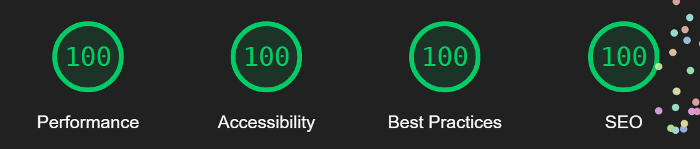

For the game page I did well, except on performance:

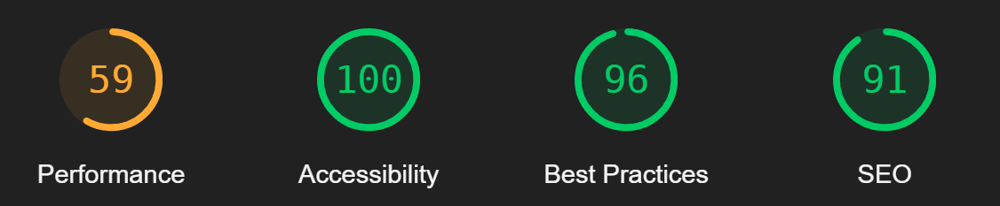

This was due to the inefficient loading of the embedded youtube video. One fix would be to implement lazy loading of the video. I plan on doing this in the future.

### Wave
I used the chrome extension for [WAVE](#wave) to test accessibility.
For the landing page I got:

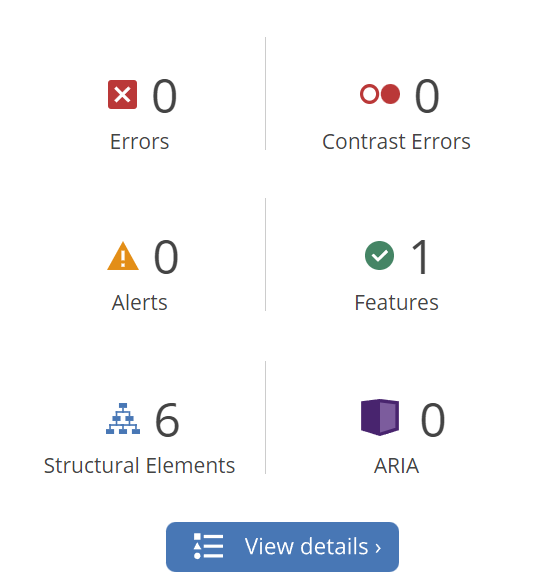

For the game page I got:

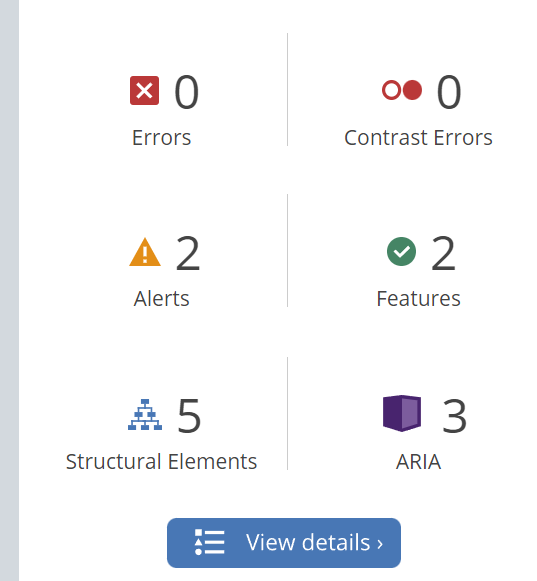

One of the alerts is to a redundant link. I addressed this by removing the link in the header.
The other alert is to the youtube video that is embedded.

[return to Table of Contents](#toc)

## Deployment 
To deploy the project follow the following steps.

1. Copy/Clone the <a href="https://github.com/smtilson/pp2-quiz-project" target="_blank">repository</a> on github.

2. Go to your copy of the repository on your github page (likely `https://github.com/YOUR-USERNAME-HERE/pp2-quiz-project`)

3. Open settings tab on top right of page

4. Click on pages link on the left sidebar in the "Code and Automation" section.

5. Set "Source" to "Deploy from branch", select "main" branch, and set folder to /(root) under "Build and Deployment". Then click Save.

6. Return to the "Code" tab and wait for site to build. Try doing a hard refresh.

7. On the right hand side under "Deployments", click on "github-pages".

8. Click on the link which matches `https://USERNAME.github.io/REPO-NAME/` to view the deployed site.

[return to Table of Contents](#toc)

## Credits and Outside Sources 

### Technologies, Frameworks, and resources used
I coded this project in HTML, CSS, and Javascript. I used Github, and git for version control to manage the project. I used Gitpages to host the project. I used chrome dev tools to debug the code and adjust the appearance of the project. I used Font Awesome for the arrows at the bottom of the game page.
I used Balsamiq to make the wireframes.

- <a href="https://validator.w3.org/#validate_by_input" target="_blank">W3 HTML validator</a> 
- <a href="https://jigsaw.w3.org/css-validator/#validate_by_input" target="_blank">Jigsaw W3 CSS validator</a>
- <a href="https://jshint.com/" target="_blank">JSHint: Javascript tool</a>
- <a href="https://chromewebstore.google.com/detail/lighthouse/blipmdconlkpinefehnmjammfjpmpbjk" target="_blank">Lighthouse chrome plug in</a> 
- <a href="https://chromewebstore.google.com/detail/wave-evaluation-tool/jbbplnpkjmmeebjpijfedlgcdilocofh" target="_blank">WAVE evaluation tool chrome plug in</a> 
- <a href="https://fontawesome.com" target="_blank">Font Awesome</a>
- <a href="https://balsamiq.com/" target="_blank">Balsamiq</a>
- <a href="https://webformatter.com/html#google_vignette" target="_blank">HTML formatter</a> (this did add /> to the end of self closing tags in the header. These were flagged by the HTML validator and removed.)

### Inspiration
The Love Math walkthrough was very helpful for understanding how to even structure such a project. It also helped with presenting a good development procedure. It encouraged me to use iteration. I first began by making the game work for a very small set of parameters, and then I increased the functionality slowly from there.

### StackOverflow
- <a href="https://stackoverflow.com/questions/10436523/remove-a-long-dash-from-a-string-in-javascript" target="_blank">SO: special dash characters</a> 
- <a href="https://stackoverflow.com/questions/30358630/html-body-not-filling-complete-width-on-mobile-devices" target="_blank">SO: body width question</a> 
- <a href="https://stackoverflow.com/questions/618089/can-i-insert-elements-to-the-beginning-of-an-element-using-appendchild" target="_blank">SO: insert element before</a>
- <a href="https://stackoverflow.com/questions/196972/convert-string-to-title-case-with-javascript" target="_blank">SO: title case with JS</a>

### Mentor
My mentor gave helpful feedback. He suggested I make a database object in JS to store the solutions instead of hiding them in the html. He suggested that I change the size of some key elements to improve the appearance. He also suggested that I give an example in the readme.

### Slack
- Daisy_mentor suggested the WAVE tool, as well as making an empty span and populating it with feedback.
- Anders suggested using the Issues tab in github.
- Beardie mentioned that students received poor marks for using 'let' when they should have used 'const'. This was helpful information.

### Feedback
I showed the app to other members of my cohort (Holinda, Alex, and Anders), members of my family (my brother and my wife), and my friends (Lou and Mike). They gave me positive encouragement and feedback. In particular, Lou pointed out that the page looked poorly on his Pixel 4 phone. A screenshot Anders sent pointed to the submission areas being in the "wrong" place. I also received feedback regarding the difficulty of the quiz. This is why I have added the blurb on the landing page.

### Javascript, HTML, and css
- <a href="https://developer.mozilla.org/en-US/docs/Learn/HTML/Howto/Use_data_attributes" target="_blank">Data attributes</a>
- <a href="https://www.w3schools.com/howto/howto_js_add_class.asp" target="_blank">How to add a class using JS</a>
- At one point during the project, I organized similar functions into a Javascript object. This is something I learned when working with python. I later moved these functions to a separate file and this became unnecessary.
- <a href="https://developer.mozilla.org/en-US/docs/Web/JavaScript/Reference/Global_Objects/Array/map" target="_blank">Array method map and '=>' syntax</a>
- <a href="https://developer.mozilla.org/en-US/docs/Web/API/Element/setAttribute" target="_blank">setAttribute method</a>
- <a href="https://gamedevacademy.org/javascript-docstrings-tutorial/#How_to_Write_a_Docstring_in_JavaScript" target="_blank">Pointers on JS docstring format</a>
- <a href="https://www.w3schools.com/html/html_youtube.asp" target="_blank">W3 schools on youtube videos in html</a>

### Non-coding references

#### Images and Color palette
Favicon:
I used the image from Girl Talk's unstoppable album (as it has his face on it) and I gave this to the favicon generator.
 - <a href="https://upload.wikimedia.org/wikipedia/en/8/8c/Unstoppable_%28Girl_Talk_album%29_cover_art.jpg" target="_blank">Unstoppable Album cover from Wikipedia</a>
 - <a href="https://favicon.io/favicon-converter/" target="_blank">Favicon Generator</a>

 For the color palette, I sampled colors from the album cover for All Day using [this tool](#color-eyedropper). I did end up using plain white for text though, as this was clearer.
 - <a href="https://upload.wikimedia.org/wikipedia/en/1/10/Girl_Talk_All_Day.jpg" target="_blank">All Day album cover</a>
 - <a href="https://chromewebstore.google.com/detail/colorpick-eyedropper/ohcpnigalekghcmgcdcenkpelffpdolg" target="_blank">Color Pick Eyedropper chrome extension</a>

#### Music
Youtube videos for each song are used.
They are:
- <a href="https://www.youtube.com/watch?v=4bMM7tGV9MI" target="_blank">Oh No</a>
- <a href="https://www.youtube.com/watch?v=FtsxfquYHf0" target="_blank">Let It Out</a>
- <a href="https://www.youtube.com/watch?v=xVmXXWcfitw" target="_blank">Thats Right</a>
- <a href="https://www.youtube.com/watch?v=Ka3GznTXur8" target="_blank">Jump On Stage</a>
- <a href="https://www.youtube.com/watch?v=DZu_lLGFDtM" target="_blank">This Is The Remix</a>
- <a href="https://www.youtube.com/watch?v=lzf8NNF1Af4" target="_blank">On And On</a>
- <a href="https://www.youtube.com/watch?v=MRCEgD1nRRM" target="_blank">Get It Get It</a>
- <a href="https://www.youtube.com/watch?v=Nr2cfwR0roU" target="_blank">Down For The Count</a>
- <a href="https://www.youtube.com/watch?v=9DBmMoW5lSs" target="_blank">Make Me Wanna</a>
- <a href="https://www.youtube.com/watch?v=p1pd69r1Il8" target="_blank">Steady Shock</a>
- <a href="https://www.youtube.com/watch?v=i0yY0zxk-18" target="_blank">Triple Double</a>
- <a href="https://www.youtube.com/watch?v=Bo5bBq2j2EE" target="_blank">Every Day</a>

#### Sample list
- The solutions data is taken from <a href="https://girltalk.fandom.com/wiki/All_Day" target="_blank">Girl Talk fandom wiki: All Day</a>.
- The official samples list, without time stamps, is from <a href="https://illegalart.net/allday/samples.html" target="_blank">Illegal Art: GIRL TALK - ALL DAY SAMPLES LIST</a>.
- Unfortunately, the official download site no longer allows for download of the album, <a href="https://illegalart.net/allday/" target="_blank">Girl Talk - All Day</a>.

#### Miscellaneous
- <a href="https://stackoverflow.com/questions/14675913/changing-image-size-in-markdown" target="_blank">Image size in markdown</a>
- <a href="https://screenresolutiontest.com/" target="_blank">Common resolution sizes</a>
